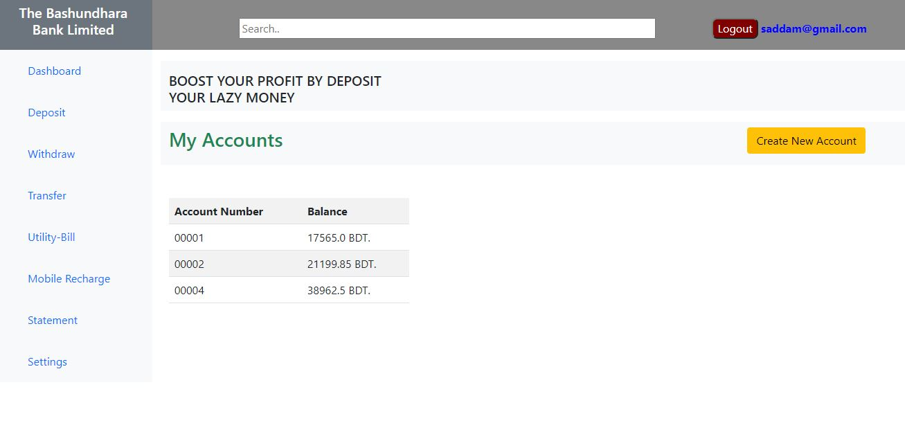
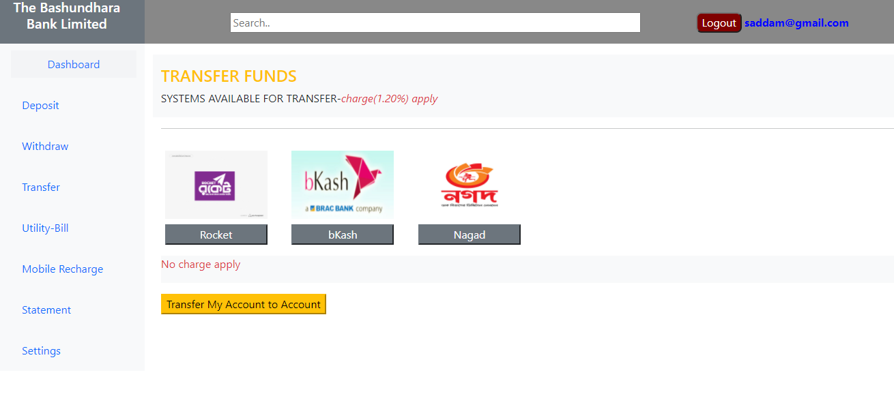

# Online Banking Management System
```
# Author Md Saddam Hossain
```
### Email:
 saddam30061994@gmail.com

1.Two Module

- User Module
- Admin Module

## Technogy Used
- Spring boot for Autoconfiguration
- Spring MVC For Web applcation development
- jsp used for User Interface
- JPA , Hibernate used
- Database Used mySQL
  
### Sample images
```
## Login Page
```

```
## SignUp Page
```

```
## User Dashboard
```

```
## Deposit method
```

```
## Deposit Form
```

```
## Transfer method
```

```
## Transfer Form after calculation
```


```
## Statement show
```

```
## Profile settings
```


```
## Admin Dashboard
```

```
## Revenue Chart for Admin
```

```
# Project Run Command
- download zip forder
- unzip and open folder with netbeans/eclipse ide
- create a database name abbank in mySQL
- clean and build folder
- finaly run maven Goals 
```
